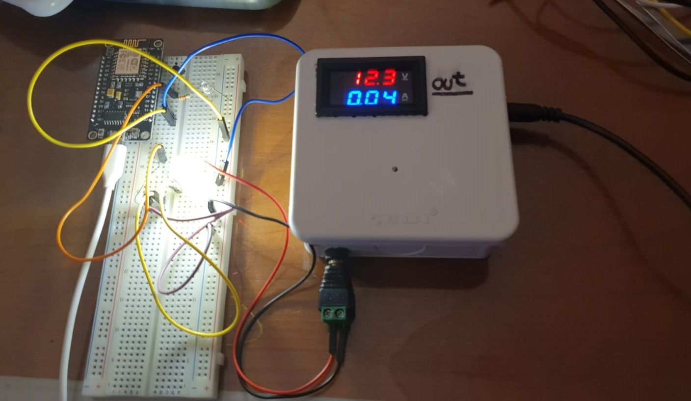

# smartHome
Control of the home appliances via local network and any smart device

# Setup
## Custom Sonoff (customSonoff)
- Buy a USB to TTL converter board (such as [FT232RL](https://www.google.com/search?q=ft232rl+usb+to+ttl))
- If it does not have a 3.3 V regulator embedded, buy an external regulator (such as [LM2596 adjustable buck converter](https://www.google.com/search?q=lm2596+module)) to supply 3.3 V.
- Adjust the regulator to 3.3V (if it is not a fixed 3.3V regulator).
- Solder headers to sonoff (see picture below)
- Connect the FTDI module to PC alone.
- If PC could not find its driver automatically, install its drivers manually.
- After the board is recognized by the pc, disconnect the FTDI from PC.
- Made the connections as follows:

| sonoff | pc |
| --- | --- |
| GND | FTDI GND|
| TX | FTDI RX |
| RX | FTDI TX |
| 3V3 | 3.3V (Regulator Vout Positive) |

- Make sure the regulator and PC grounds are connected (If you are using PC to power the regulator, it is OK too since the grounds meet at the motherboard)
- Plug back FTDI in to PC
- Press the button on sonoff
- While keeping pressed, plug the regulator.
- Release the button after 2-3 seconds.
- Open Arduino IDE
- Select board "Generic ESP8266 Module" (even if your sonoff have ESP8285 chip or you see ITEAD Sonoff on the menu; do not select them)
- Make sure the flash mode is selected as "DOUT"
- Select erase flash "All Flash Contents"
- Select your COM port
- Upload the sketch
- After uploading the first version of the firmware via cable, thanks to the Arduino OTA, now you can upload new firmware wirelessly by selecting the corresponding network port from Arduino IDE.

### Images

FT23RL close-up

LM2596 Buck Converter

FT232RL

Inside Sonoff

Headers

## Lamp Controller (lampController) & DC Powerbox (dcPowerbox)
- Regular ESP8266 code uploading procedure. Just select the CPU frequency 160 MHz for speed.

# System Details
## HTML to INO & INO to HTML
These python scripts convert HTML files to Arduino IDE compatible strings or vice versa.

## Custom Sonoff (customSonoff)
Custom firmware for sonoff basic r2 (v1.4) for better integration with the home automation system. My sonoff includes the ESP8285 module, which is the same as ESP8266, except the ESP8285's flash memory is 1 MB. Hence, an ESP8266 can be used as debugging device.

### Schematic

### Webpage

### Debug Setup

## Lamp Controller (lampController)
The system consists of two sub-units: The control box and the relay boxes. The system is designed in two subunits to increase safety by eliminating the need for long power (230V AC) cords. The long wires installed all across the room only carry a 5V DC signal, which is safe.

### Schematic

### Webpage

### Control Box
The control box contains an ESP8266 as a processor and a 4-way relay module to generate signals for the relay boxes. In addition, there exists a green LED as a power indicator.

### Images of the device

Top

Left

Right

### Relay Box
- The phase cable coming from the wall socket is connected to the common pin of the relay, and the output phase cable is connected to the normally open pin, i.e., turned off when not excited, of the relay. The neutral cable directly goes from the wall plug to the output receptacle.
- The +5V of the signal cable is connected to the VCC on the relay module, and both the signal and GND of the relay are connected to the ground of the signal wire. 
By doing so, the output receptacle is energized when a 5V supply is connected to the signal plug.
 
### Images of the device

Explanation

Inside

Off

On

### Images from the setup

Bookcase Lamp

Floor Lamp

Lampshade

## DC Powerbox (dcPowerbox)
The system handles the low-voltage peripherals in the room. It has 4 outlets for the Music Visualizer, the Ambiance Light, the Fans, and the Laptop Cooler. The system has an external IC2 EEPROM to store the relay states. The python scripts in the AUTOMATION folder are adjusted to run at startup, shutdown, sleep and wake events of the PC. Moreover, for manual control, either the scripts in the MANUAL folder or the web pages may be used.

### Schematic

### Webpage

### Images of the device

Top

In

Front

Left

Right

Back

### Images from the setup

Music Visualizer

# References
 - https://mytectutor.com/esp8266-nodemcu-relay-control-from-web-page-over-wifi/
 - https://randomnerdtutorials.com/esp8266-ota-updates-with-arduino-ide-over-the-air/
 - https://randomnerdtutorials.com/reprogram-sonoff-smart-switch-with-web-server/
 - https://esphome.io/devices/sonoff_basic.html

 --> External EEPROM reading-writing functions are adopted from the link below:
 - https://dronebotworkshop.com/eeprom-arduino/
 - https://arduino-projects4u.com/arduino-24c16/
