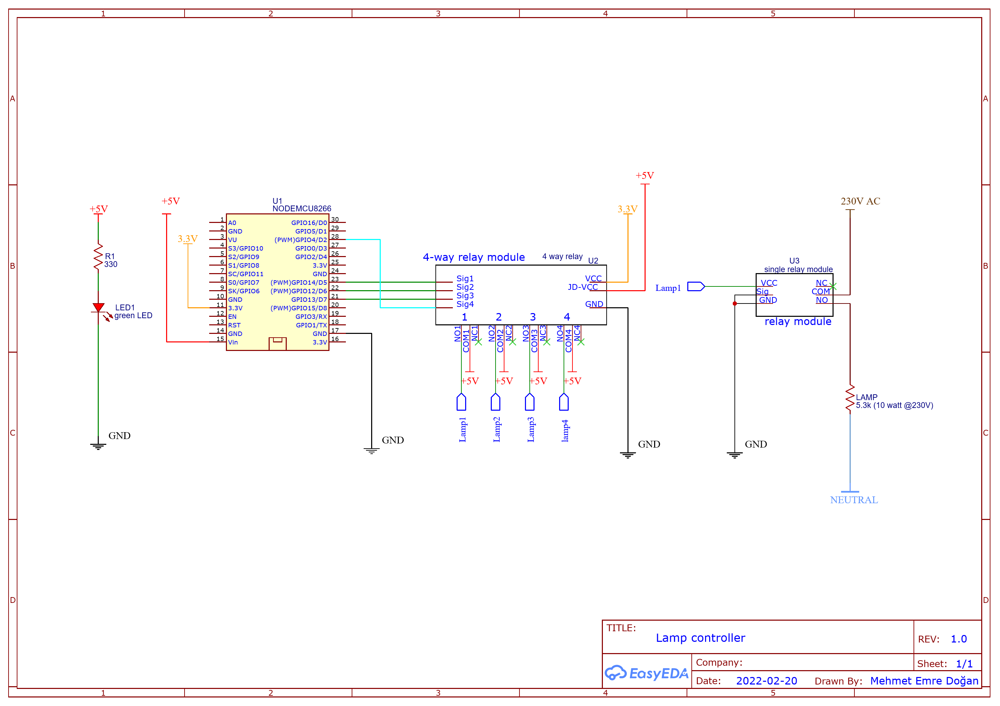

# smartHome
Control of the home appliances via local network and any smart device

# Setup
Lorem ipsum dolor sit amet consectetur adipisicing elit. Rem animi alias, amet iste porro molestias deserunt, velit iusto mollitia ab fugiat qui dolore excepturi similique recusandae earum officiis quam ut sed quod doloribus ex maxime! Perferendis veritatis quas a sed laudantium iste recusandae ipsam eius voluptatibus consequuntur nulla repudiandae, perspiciatis magni fugiat.  

# System Details
## HTML to INO & INO to HTML
These python scripts convert HTML files to Arduino IDE compatible strings or vice versa.

## Custom Sonoff (customSonoff)
Custom firmware for sonoff basic r2 (v1.4) for better integration with the home automation system. My sonoff includes the ESP8285 module, which is the same as ESP8266, except the ESP8285's flash memory is 1 MB. Hence, an ESP8266 can be used as debugging device.

### Schematic

### Webpage

### Setup

## Lamp Controller (lampController)
The system consists of two sub-units: The control box and the relay boxes. The system is designed in two subunits to increase safety by eliminating the need for long power (230V AC) cords. The long wires installed all across the room only carry a 5V DC signal, which is safe.

### Schematic

### Webpage

### Control Box
The control box contains an ESP8266 as a processor and a 4-way relay module to generate signals for the relay boxes. In addition, there exists a green LED as a power indicator.

Top

Left

Right

### Relay Box
- The phase cable coming from the wall socket is connected to the common pin of the relay, and the output phase cable is connected to the normally open pin, i.e., turned off when not excited, of the relay. The neutral cable directly goes from the wall plug to the output receptacle.
- The +5V of the signal cable is connected to the VCC on the relay module, and both the signal and GND of the relay are connected to the ground of the signal wire. 
By doing so, the output receptacle is energized when a 5V supply is connected to the signal plug.
 

Explanation

Inside

Off

On

### Images from the setup

Bookcase Lamp

Floor Lamp

Lampshade

# References
 - https://mytectutor.com/esp8266-nodemcu-relay-control-from-web-page-over-wifi/
 - https://randomnerdtutorials.com/esp8266-ota-updates-with-arduino-ide-over-the-air/
 - https://randomnerdtutorials.com/reprogram-sonoff-smart-switch-with-web-server/
 - https://esphome.io/devices/sonoff_basic.html
